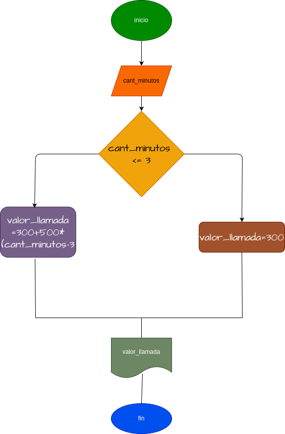

# programa #3
## Costo de una llamada telefònica

ingresar el tiempo de duracion de una llamada telefonica y determinar lacantidad a pagar, deacuerdo con lo siguiente: 

- Toda llamada que dure 3 minnutos o menos tiene un costo de 300 pesos.

- cada minuto adicional custa 50 pesos 
# diseño

